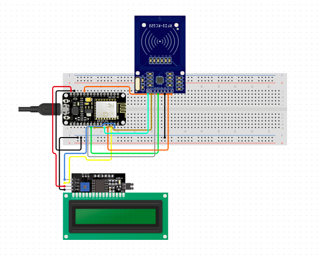

# Smart Tourism Device

[Radio-frequency identification (RFID)](https://en.wikipedia.org/wiki/Radio-frequency_identification) based card scanner device using [NodeMCU](https://www.nodemcu.com/index_en.html) and [MFRC522](https://www.nxp.com/products/rfid-nfc/nfc-hf/nfc-readers/standard-performance-mifare-and-ntag-frontend:MFRC52202HN1) module.
This device uses MFRC522 module to scan the tag id of RFID based card and NodeMCU to communicate with the HTTP Server.
This device also uses LCD 16x2 with I2C Module to shows information related to the device's current status.

We created this project as part of the Smart Tourism project that consists of several parts like [REST server](https://github.com/threeal/smart-tourism-server), [card scanner device](https://github.com/threeal/smart-tourism-device), [administrator website](https://github.com/threeal/smart-tourism-web), and [location's direction app](https://github.com/threeal/smart-tourism-app).
Smart Tourism project is a system for smart tourism that improves the impression of tourism sites using an electronic card to enter and exit locations, a website that monitors and show statistic for each location, and AR app for visitors to show location's direction.
This project is undertaken to fulfill the Telematics Projects course in the [Computer Engineering department](https://www.its.ac.id/study-at-its/faculties-and-departments/faculty-electrical-technology/computer-engineering/) of [Sepuluh Nopember Institute of Technology](https://www.its.ac.id/).

## Usage

- Install Arduino IDE as in their [official guide](https://www.arduino.cc/en/Guide/).
- Open `gate.ino` in Arduino IDE.
- Add `http://arduino.esp8266.com/stable/package_esp8266com_index.json` to the Additional Boards Manager URLs in the Preferences.
- Install esp8266 boards using the Boards Manager, then set the Boards to NodeMCU 1.0 (ESP-12E Module).
- Set the `wifi_ssid` and `wifi_pass` according to the WiFi SSID and password.
- Run [the REST server](https://github.com/iruz17/project-telematika) and set the `server_address` string according to the server address.
- Set the `gate_id` according to the gate id for this device.
- Prepare the NodeMCU, MFRC522 module, and LCD 16x2 with I2C Module, then assemble them as the following diagram:

  

- Connect the NodeMCU to your computer, then upload the program using the Arduino IDE.
